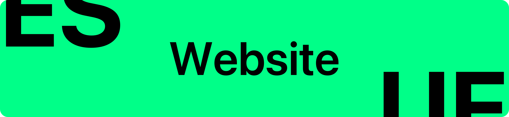
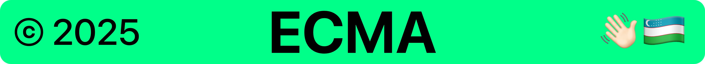

<p align="center">
    
</p>

<p align="center">
    <h3 align="center">Official website of Ecma Uzbekistan.</h3>
</p>

<p align="center">
    
    <a href="https://t.me/xinux"></a>
</p>

## About

Every community has a website to represent themselves, so obviously it should be proficient to have one for Ecma Uzbekistan as well. This project aims to maintain a website to represent Ecma Uzbekistan leveraging GitHub Pages through Nix and Nextjs.

## Development

This project has everything configured ready to get started with developer right away thanks to Nix package manager. In order to get started:

```bash
# Start development environment
nix develop -c $SHELL

# Open favorite editor of your choice
zed .

# Start development server
npm run dev
```

### Building

This project aims to remain SSG and deployed in GitHub Pages. GitHub Pages gets `nix build` output, but you can build it inside development environment using `npm` package manager.

```bash
# Building with nix`
nix build .

# Building with npm
npm run build
```

## License

This site template is a commercial product and is licensed under the [Tailwind Plus license](https://tailwindcss.com/plus/license).

## Learn more

To learn more about the technologies used in this site project, see the following resources:

- [Tailwind CSS](https://tailwindcss.com/docs) - the official Tailwind CSS documentation
- [Next.js](https://nextjs.org/docs) - the official Next.js documentation
- [Headless UI](https://headlessui.dev) - the official Headless UI documentation

## Thanks

- [Orzklv](https://github.com/orzklv) - Bootstraping this project + devops management.
- [Diyorbek](https://github.com/diyorbekrustamjonov) - Maintaining this website keeping it active and up to date.

## License

This project is licensed under the Tailwind Plus License and MIT - see the [LICENSE-MIT](license) and [LICENSE-TAILWIND](license-tailwind) file for details.

<p align="center">
    
</p>
